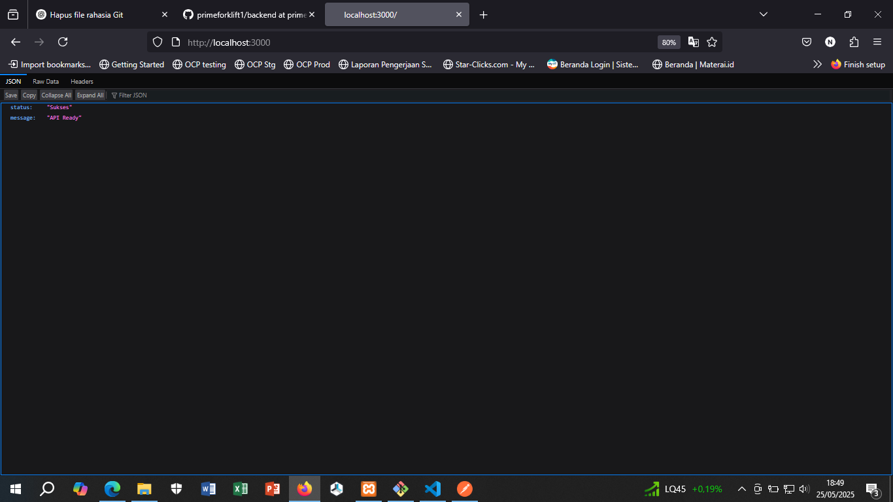

# backend project node v.22

## How To Run

1. Install all package
```
 npm install 
```
2. Setting file `.env` to configure database connection example run with XAMPP > start apache + Mysql

3. Migration Database Schema (Optional), only use if you not have database backup schema
```
npx sequelize-cli db:migrate
```
4. Run App
```
npm run start
```
5. Testing Api with browser or postman `http://localhost:3000` and see bellow :
